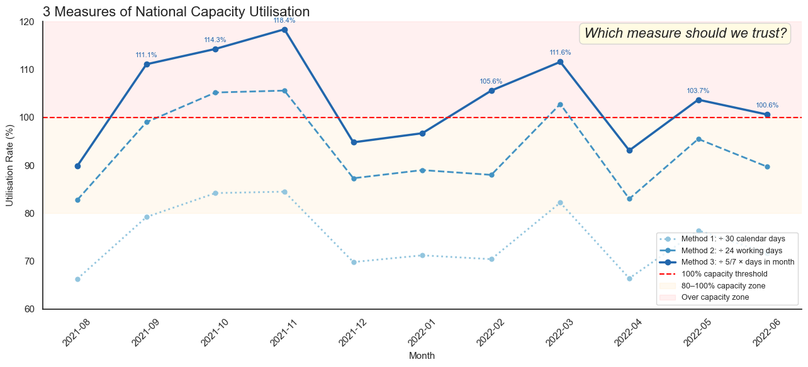
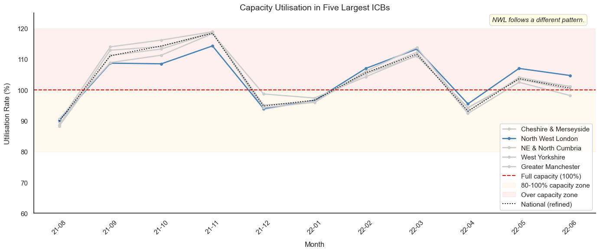
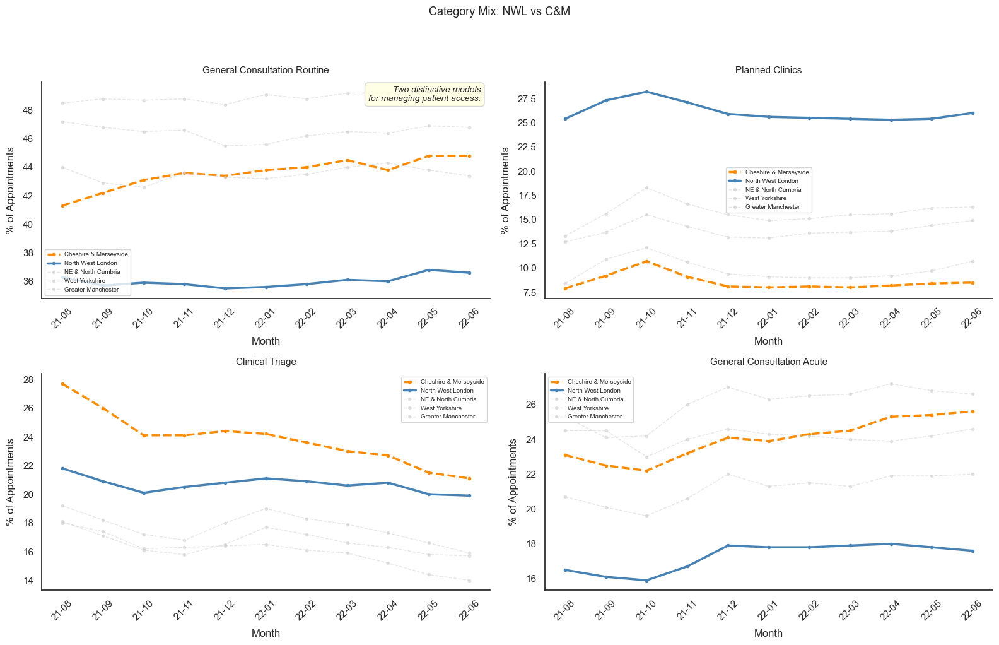
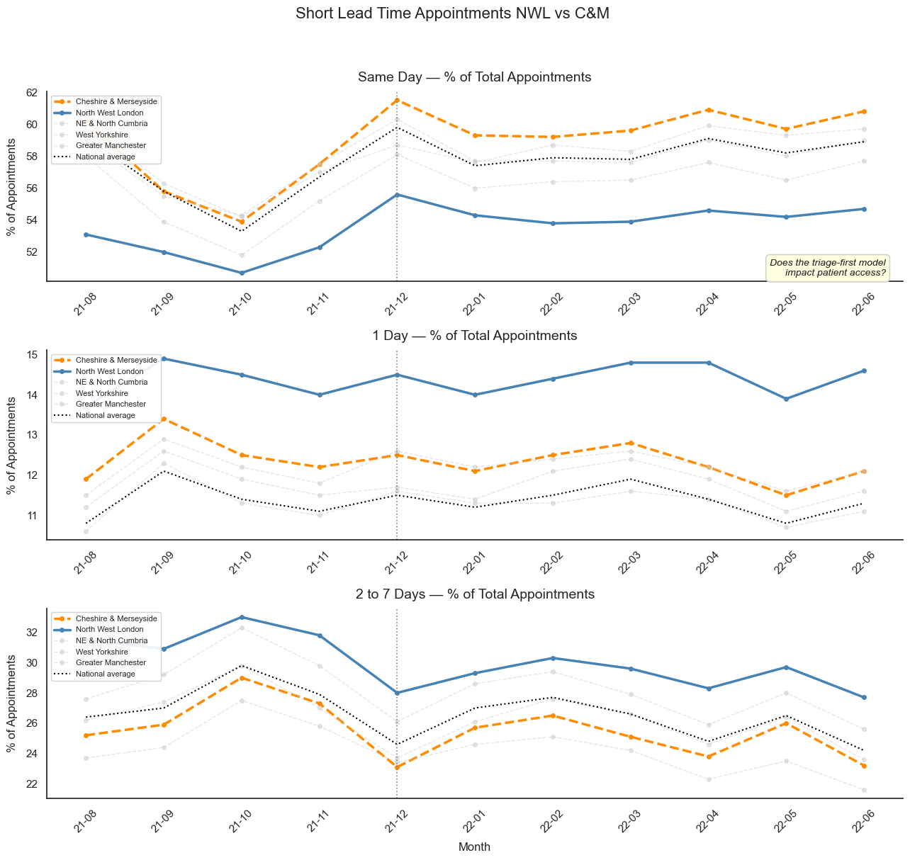

# NHS GP Appointments: Capacity and Access

Analysis of 11 months of NHS appointment records (Aug 2021 – Jun 2022) across England's Integrated Care Boards, examining system capacity and how differently ICBs manage patient access.

**Tools:** Python · pandas · Matplotlib · Seaborn · Jupyter

Produced for the LSE Data Analytics Career Accelerator, Course 2: Data Analytics using Python. Awarded a distinction.

---

## Key findings

1. **The system ran above capacity for 7 of 11 months.** Measured against the published 1.2M daily appointments benchmark, using a working-day denominator validated empirically.
2. **Two ICBs of near-identical size run structurally different access models.** North West London diverts routine and minor acute cases into planned clinics to protect GP capacity; Cheshire & Merseyside uses triage to prioritise, with almost all routes still leading to a GP.
3. **Each model sacrifices something.** NWL has the lowest same-day appointment rate of the five largest ICBs; C&M the highest. Efficiency and access trade off against each other, and neither model is optimal.
4. **Missed appointments are not the problem.** DNA rates are 4–5.5% nationally and stable. NWL sits 14th of 42 ICBs, above average, but not an outlier.
5. **Lead-time bands obscure clinically significant differences.** The data does not distinguish a 2-day wait from a 7-day wait for unplanned illness.

*Three progressively refined denominators. The naive calendar-day method understates utilisation by ~20 percentage points and never breaches the threshold; the validated method shows the system over capacity for most of the period. The measurement choice determines the answer.*

*NWL (blue) against the four other largest ICBs and the national average. Six alternative hypotheses — missed appointments, list size, appointment mode, video uptake, staffing mix, patient demand — were tested and rejected before category mix identified the driver.*

*NWL runs planned clinics at roughly 26% of appointments against C&M's 8–10%, and routine consultations at 36% against C&M's 45%. Note the triage panel: C&M, not NWL, records the higher rate — triage here prioritises access to a GP rather than diverting demand away from one.*

*The trade-off made visible. NWL sits ~6 points below the national average on same-day access and above it on both 1-day and 2–7 day waits — so patients are not waiting longer overall, they are waiting longer for urgent care. Null lead-time rates were checked and are lowest in NWL, so this is a genuine access difference rather than a recording artefact.*

## Recommendations

- Investigate NWL's access performance (clinical outcomes and A&E attendance rates) before recommending its triage model for wider adoption.
- Gather patient feedback directly on access and on reasons for missed appointments, rather than relying on scraped social data.
- Amend lead-time bands to distinguish short waits, enabling clinical safety monitoring where triage-first models restrict same-day access.

---

## Method

Four datasets were supplied; two were excluded and the exclusions documented. Twitter data proved largely US-based and irrelevant to English GP access; `actual_duration` was excluded because duration recording varies by GP system, with nulls and implausible values grouped into an unknown category.

National capacity utilisation was calculated three ways, and the working-day assumption underlying the final method was then tested against the data: 97.9% of appointments fall Monday to Friday. Sub-ICB comparisons were normalised by registered patient count using the June 2022 release, matching the final month of the appointment period. A later release was trialled and rejected: registered patients grew by 2.2M by April 2026, concentrated in urban areas, which would have distorted cross-ICB normalisation.

## Limitations

Metadata quality means all findings are indicative: 13.1% of national categories are unmapped or inconsistently mapped, 23.1% of lead times are null, appointment counts are partly estimated, and appointment mode is unreliable. HCP type is dependable only for GP classification, which limits what the observed shift towards other practice staff can be said to demonstrate.

The period is also post-COVID and cannot be assumed typical — the autumn and March peaks may not recur.

## Use of AI

The analytical questions, method decisions, interpretation and findings in this repository are my own. AI assistance (Claude, Anthropic) was used to produce code from that direction, to explain Python syntax and concepts, and to troubleshoot errors during data import and execution. I am able to explain and defend the technical content.

---

## Files in this repository

| File | Description |
| --- | --- |
| `nhs_technical_report.pdf` | Full technical report: approach, analysis and findings |
| `nhs_appointments_analysis_extract.ipynb` | Jupyter notebook — the analysis, from data quality checks through to the lead-time findings |
| `nhs_slide_deck.pptx` | Presentation slides (animated) |
| `nhs_slide_deck.pdf` | Presentation slides (static) |
